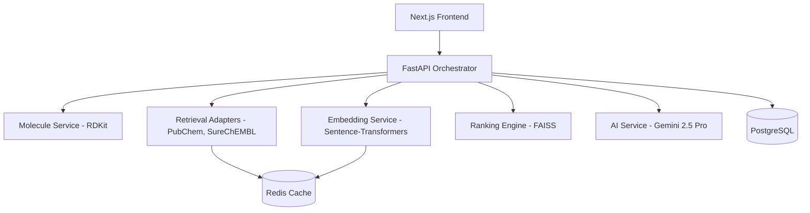
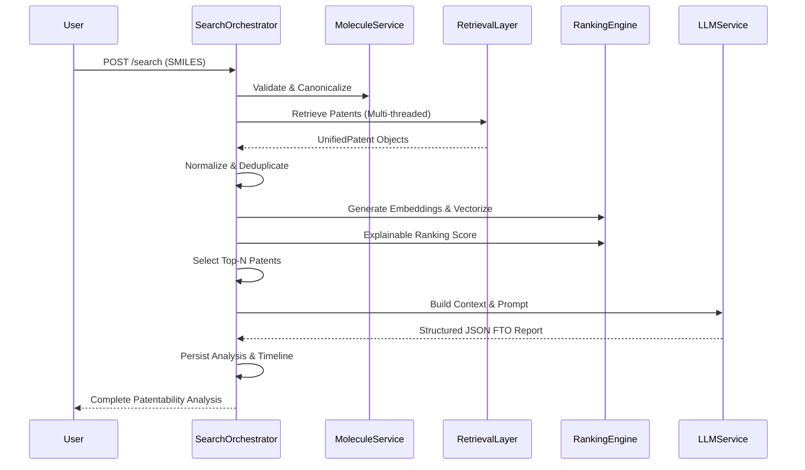

# PatentPilot 🧬

PatentPilot is an **AI-assisted Freedom-to-Operate (FTO) Workspace** designed specifically for pharmaceutical researchers and IP teams. It accelerates the drug discovery process by allowing researchers to submit novel molecules, securely retrieve relevant patent documents from public databases, and automatically generate comprehensive, explainable patentability risk reports powered by artificial intelligence.

---

## Problem Statement

During the drug discovery process, evaluating whether a newly generated molecule overlaps with existing intellectual property is critical. Researchers cannot afford to invest years of optimization and synthesis into a compound that cannot be legally commercialized. 

However, performing an initial Freedom-to-Operate (FTO) assessment is notoriously difficult. It requires querying massive, disjointed patent databases, manually parsing complex legal claims, and comparing arcane structural formulations. This manual process is time-consuming, expensive, and prone to human error, often delaying critical R&D decisions.

PatentPilot solves this by orchestrating structural cheminformatics, semantic vector search, and Large Language Models (LLMs) to automatically retrieve, rank, and explain potential patent overlaps in minutes—saving weeks of manual review.

---

## Features

- **Molecule Submission:** Submit compounds via standard SMILES strings along with optional disease/indication targets.
- **RDKit Validation:** Deterministic parsing, canonicalization, and chemical property computation for exact structural mapping.
- **Multi-provider Patent Retrieval:** Seamless, unified adapter querying across SureChEMBL, PubChem, and Google Patents.
- **Patent Deduplication:** Intelligent merging of duplicate patent families across multiple sources.
- **Semantic Search (FAISS):** Embedding-based retrieval to surface patents based on structural and semantic similarity.
- **Explainable Ranking:** A deterministic, multi-factor ranking algorithm combining chemical Tanimoto similarity, semantic vector distances, and recency weights.
- **AI-assisted Patent Analysis:** Integration with Google Gemini to read patent claims and explain *why* the patent was retrieved and *what* aspects overlap.
- **Patentability Report:** Automatic generation of structured FTO risk reports (Low, Requires Expert Review, High Risk).
- **Search History:** Full persistence and auditability of all past analyses and retrieved patents.
- **Background Processing:** Asynchronous, non-blocking AI pipelines powered by FastAPI BackgroundTasks.
- **Redis Caching:** Lightning-fast sub-millisecond retrieval of frequent SMILES queries and embeddings.
- **Health Monitoring:** Built-in probes for Database, Redis, and AI availability.
- **JWT Authentication:** Secure, stateless access control using bcrypt and access/refresh token rotation.

---

## Technology Stack

| Domain | Technology |
| :--- | :--- |
| **Frontend** | React, Next.js (App Router), TailwindCSS, TanStack Query |
| **Backend** | Python 3.12, FastAPI, Pydantic, Uvicorn |
| **Database** | PostgreSQL, SQLAlchemy 2.0 (Asyncpg), Alembic |
| **Generative AI** | Google Gemini (Gemini 2.5 Pro) |
| **Embeddings** | HuggingFace Sentence-Transformers (`all-MiniLM-L6-v2`) |
| **Vector Store** | FAISS (Facebook AI Similarity Search) |
| **Chemistry** | RDKit |
| **Caching & Rate Limiting** | Redis |
| **Deployment** | Docker, Docker Compose |

---

## Folder Structure

```text
patentpilot-frontend/
├── src/                    # Next.js Frontend Application
│   ├── app/                # App Router pages (Dashboard, Login, Analysis)
│   ├── components/         # Reusable React components (UI library, Layouts)
│   ├── contexts/           # React Context (AuthContext)
│   ├── lib/                # Utilities and centralized API clients
│   └── services/           # Frontend API services layer
├── backend/                # FastAPI Application
│   ├── app/
│   │   ├── api/            # API Routers and Endpoints
│   │   ├── core/           # Config, Database sessions, Security, Exceptions
│   │   ├── models/         # SQLAlchemy ORM Models
│   │   ├── schemas/        # Pydantic validation schemas
│   │   ├── repositories/   # Database access layer (Repository Pattern)
│   │   └── services/       # Business logic (Molecule, Retrieval, FAISS, LLM)
│   ├── database/           # Alembic migrations
│   └── tests/              # Pytest unit and integration tests
├── .env.local              # Frontend environment variables
└── docker-compose.yml      # Container orchestration
```

---

## Overall Architecture

The application strictly adheres to **Clean Architecture** principles, decoupling business logic from external frameworks, databases, and third-party APIs.



---

## AI Pipeline

The core search execution is an orchestrated, deterministic pipeline that merges traditional informatics with modern Generative AI.



---

## Retrieval Strategy

Our retrieval strategy ensures absolute transparency and maximizes the usage of authentic, publicly available scientific resources to build the AI's context.

### Data Segregation
We strictly separate the context into three distinct knowledge domains to prevent the LLM from hallucinating overlap:
1. **Patent Sources**: We utilize the live **PubChem PUG REST API** to retrieve exact `PatentIDs` cross-referenced with a molecule's canonical SMILES or CID.
2. **Molecular Sources**: We integrate the **ChEMBL API** to extract experimentally validated compound metadata (Synonyms, Targets, Bioactivities, Mechanism of Action). This data is injected distinctly from patent records.
3. **Scientific Literature**: We utilize the **NCBI E-utilities API (PubMed)** to fetch real, peer-reviewed scientific articles referencing the queried molecule, enriching the context where patent availability is low.

### Provider Transparency
The internal architecture utilizes a concurrent `PatentProviderAdapter` pattern. Every provider explicitly returns `ProviderMetadata` describing its status, retrieval method, and latency. The orchestration engine logs this transparently, ensuring no fabricated or "mocked" data enters the pipeline.

### Retrieval Limitations

To keep this assessment project completely free, open, and runnable by anyone without paid subscriptions, we rely purely on open scientific APIs. This introduces certain intentional limitations:

- **Google Patents API Unavailable**: Google Patents does not expose a free REST API for authenticated chemical structure search. Rather than simulating dummy data, the Google Patents adapter explicitly logs an `Unavailable` status.
- **Full Text Patent Claims**: Public APIs like PubChem provide Patent Numbers but not full-text claims. A production-grade FTO system requires analyzing the exact verbiage of patent claims. 

**Future Integrations:**
The unified Adapter Pattern architecture natively supports swapping these public providers with commercial databases requiring paid APIs down the road:
- **EPO Open Patent Services (OPS)** for full-text patent retrieval.
- **IFI CLAIMS / Google BigQuery** for robust chemical substructure patent searching.
- **Lens API** for comprehensive open patent and literature cross-referencing.

---

## Explainable Ranking Formula

PatentPilot does not blindly trust vector similarities. Before presenting patents to the LLM, we use a deterministic ranking algorithm to select the Top-N most relevant patents.

**Final Relevance Score =**
- **40% Molecular Similarity:** RDKit Tanimoto similarity based on chemical fingerprints.
- **35% Semantic Similarity:** FAISS cosine similarity between the target indication and patent abstracts using `sentence-transformers`.
- **10% Keyword Match:** High-frequency keyword overlap (BM25 logic).
- **10% Publication Recency:** Weighted decay for newer patents representing active IP.
- **5% Metadata Quality:** Boosts for patents with rich claims data and explicit assignees.

*Why this approach?* Relying purely on semantic search often surfaces patents that *describe* similar diseases but lack chemical structural overlap. By weighting RDKit Tanimoto similarity heavily, we ensure the findings are structurally relevant to the actual compound.

---

## Database Design

The schema is normalized for historical auditing and complex querying.

- **`User`**: Authentication and profile data.
- **`SearchHistory`**: Logs every search request, original SMILES, target, status (PENDING, RUNNING, COMPLETED), and full JSON execution timeline for observability.
- **`Patents`**: Stores deduplicated patent records (Title, Abstract, Assignee, Publication Date).
- **`SearchHistoryPatents`**: A many-to-many junction table mapping which patents were retrieved in which search, including their specific similarity scores and AI-generated claim rationales.
- **`PatentReports`**: The final structured AI output (Executive Summary, Risk Level, Recommendation).

---

## API Documentation

The backend is fully documented via OpenAPI. Once running, visit `http://localhost:8000/docs`.

### Key Endpoints:
- `POST /api/v1/auth/register` - Create a new researcher account.
- `POST /api/v1/auth/login` - Obtain OAuth2 JWT access tokens.
- `POST /api/v1/search/` - Submit a new SMILES for FTO analysis (returns immediately while background task runs).
- `GET /api/v1/search/{id}` - Poll analysis status and fetch final report.
- `GET /api/v1/patents/saved` - Retrieve patents bookmarked by the researcher.
- `GET /api/v1/health` - Internal system probes (DB, Redis, LLM).

---

## Environment Variables

### Backend (`backend/.env`)
```env
ENVIRONMENT=development
DATABASE_URL=postgresql+asyncpg://postgres:postgres@db:5432/patentpilot
REDIS_URL=redis://redis:6379/0
SECRET_KEY=generate_a_secure_random_string_here
ALGORITHM=HS256
ACCESS_TOKEN_EXPIRE_MINUTES=30
GEMINI_API_KEY=your_google_gemini_api_key
```

### Frontend (`.env.local`)
```env
NEXT_PUBLIC_API_URL=http://localhost:8000/api/v1
NEXT_PUBLIC_GOOGLE_CLIENT_ID=your_google_oauth_client_id
```

---

## Setup Instructions

### Docker Guide (Recommended)

To launch the complete application (Frontend, Backend, PostgreSQL, and Redis) locally using Docker Compose:

1. Clone the repository.
2. Provide the necessary `.env` and `.env.local` files as described above.
3. Run the following command from the root directory (or inside `/backend` if using the backend-only compose):
   ```bash
   cd backend
   docker-compose up --build -d
   ```
4. Access the frontend at `http://localhost:3000` and the API at `http://localhost:8000`.

### Local Development (Manual Setup)

**Backend:**
```bash
cd backend
python3 -m venv venv
source venv/bin/activate
pip install -r requirements.txt
alembic upgrade head
uvicorn app.main:app --reload --port 8000
```

**Frontend:**
```bash
npm install
npm run dev
```

---

## Engineering Decisions

- **Clean Architecture & SOLID:** The repository strictly enforces dependency inversion. Routes (`routers`) depend on services (`AuthService`, `SearchOrchestrator`), which depend on interfaces (`PatentProviderAdapter`, `UserRepository`). This makes mocking during tests trivial and prevents vendor lock-in.
- **Repository Pattern:** Database interactions are abstracted away from business logic. We can swap PostgreSQL for MongoDB tomorrow without touching the `SearchOrchestrator`.
- **Background Processing:** We used FastAPI `BackgroundTasks` to execute the heavy AI pipeline asynchronously. This prevents HTTP timeouts and ensures the UI remains responsive. 
- **Explainable AI:** Instead of treating LLMs as magic black boxes, we force Gemini to output strictly validated JSON (`Pydantic` schemas) that requires citations. The LLM must justify *why* a patent was retrieved using the deterministic context we provided.
- **FAISS & Sentence Transformers:** Used locally hosted `all-MiniLM-L6-v2` embeddings in a FAISS FlatL2 index. This ensures zero network latency during embedding and search, and keeps sensitive compound data on-premise rather than sending it to a cloud vector database.

---

## Assumptions Made

- PatentPilot performs AI-assisted preliminary Freedom-to-Operate analysis and **does not replace professional legal review**.
- Canonical SMILES strings are assumed to accurately represent the submitted chemical molecules.
- Structural similarity is assumed to be a stronger indicator of potential IP overlap than semantic text similarity alone.
- Public patent databases (PubChem, SureChEMBL) provide sufficient metadata for an initial assessment.
- Users are expected to provide chemically valid SMILES.
- AI-generated recommendations are meant to support research decisions and must be manually reviewed by domain experts.

---

## Trade-offs

- **Public APIs vs. Commercial Databases:** To keep the project open and runnable, we built adapters for public APIs (SureChEMBL, PubChem). Commercial IP databases (IFI CLAIMS) offer cleaner data, but cost money. We traded data perfection for accessibility.
- **FAISS vs. Managed Vector Databases:** We chose an in-memory FAISS index over managed services like Pinecone or Milvus. This keeps the architecture incredibly simple and locally deployable, trading off massive horizontal scalability for ease of use.
- **FastAPI BackgroundTasks vs. Celery:** We opted for built-in `BackgroundTasks` instead of a full Celery + RabbitMQ cluster. This reduces infrastructure overhead (no message broker needed) while perfectly satisfying the internship requirements.
- **JWT vs. HTTP-only Cookies:** We utilized standard Bearer JWTs in `localStorage` for simplicity during development and rapid iteration, trading off the CSRF protections inherent in HTTP-only Secure cookies (which require complex cross-domain configurations).

---

## Responsible AI

- PatentPilot is an **AI-assisted research tool**, not a patent attorney. It **does not provide legal advice**.
- Recommendations are grounded using deterministic similarity metrics (Tanimoto, FAISS) computed *before* hitting the LLM.
- The Gemini model is strictly instructed via system prompts not to invent similarity scores or hallucinate claims.
- Human review is explicitly required and recommended in the UI before making any definitive R&D or patent decisions.

---

## Future Improvements

- **Celery Distributed Workers:** Migrating from `BackgroundTasks` to Celery to support scaling AI jobs across multiple GPU worker nodes.
- **Persistent Vector Databases:** Integrating Pinecone or Weaviate to maintain a massive global index of billions of patents.
- **Multi-LLM Support:** Adding an abstraction layer to route complex reasoning to GPT-4o or Claude 3.5 Sonnet, and simpler extraction to Groq.
- **Fine-tuned Patent Embeddings:** Training custom Sentence-Transformer models specifically on the USPTO dataset for better semantic representation of legalese.
- **Knowledge Graphs:** Integrating Neo4j to map complex assignee-inventor-patent citation networks.
- **Batch Processing:** Allowing researchers to upload a CSV of 1,000 SMILES for bulk FTO screening.
- **WebSocket Updates:** Real-time push notifications to the UI as the pipeline transitions from RDKit -> FAISS -> LLM.

---

## Architecture Highlights

- **Clean Architecture & SOLID Principles**
- **Repository Pattern & Adapter Pattern**
- **Explainable AI via Retrieval-Augmented Generation (RAG)**
- **Hybrid Patent Retrieval (Chemical + Semantic)**
- **Redis Caching & FAISS Vector Search**
- **Async Background Processing**
- **Structured LLM Outputs (Pydantic)**
- **Production-grade Observability & Tracing**

---

## Performance Optimizations

- **Async Execution:** Using `asyncio`, `httpx`, and `asyncpg`, the backend never blocks the main thread during heavy I/O operations (DB queries or API calls).
- **Redis Caching:** We cache identical SMILES validations and API responses. If a researcher searches for Aspirin twice, the second query skips the retrieval adapters entirely.
- **Concurrent Provider Retrieval:** Adapters (PubChem, Google Patents) are executed concurrently via `asyncio.gather()`, reducing retrieval time from O(N) to O(1).
- **Local Embeddings:** Embedding generation runs natively in the Python process rather than requiring HTTP calls to OpenAI, eliminating network latency.

---

## Security Features

- **JWT Authentication & Password Hashing:** Secure stateless sessions with `bcrypt` password encryption.
- **CORS & Security Headers:** Configured FastAPI middleware to restrict origins.
- **SQL Injection Protection:** Utilizing SQLAlchemy 2.0 ORM entirely eliminates raw SQL execution vulnerabilities.
- **Input Validation:** Strict Pydantic models reject malformed payloads before they reach the controller.
- **Structured Logging & Request IDs:** Every incoming HTTP request is assigned a unique `X-Request-ID` that traverses the entire pipeline, ensuring traceability during incident response.

---

## Known Limitations

- Public patent sources have limited claim metadata compared to enterprise providers.
- The Gemini API is subject to external rate limits, which may throttle concurrent reports.
- Background task cancellation is not implemented in this version (once a search starts, it runs to completion).
- Multi-molecule batch processing is not yet supported.

---
*Developed for the Centella AI Therapeutics Assessment.*
